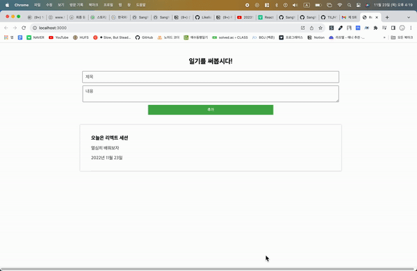

## 프론트엔드와 서버가 서로 통신하며 데이터를 읽고 쓰는 '일기장' 앱

- 한국외대 글로벌 멋쟁이사자처럼 11기 리엑트 세션

- 과제 : '작성한 날짜 저장하기' 하나만 완료

 

### ⚠️ 문제

- 깃의 submodule 문제로 인해 diary 이하의 디렉토리가 푸쉬가 되지 않습니다.

  - 11월 23일 목요일까지 도저히 해결이 안되는 상황입니다.

  - 차선책으로 프론트엔드 코드를 md 문서에 삽입하여 공유합니다.

    - <a href="https://github.com/SangYoonLee1231/hufslion-react-server-api/blob/main/frontend-code.md">바로가기</a>

- '작성한 날짜 저장하기'를 구현했으나, 원하는대로 동작하지 않습니다.

  - 제출을 2번 클릭해야 비로소 리스트에 반영되고, 그 중 첫번째 일기는 날짜가 표기되지 않습니다.

  - 이 부분에 대해선 좀 더 고민해보겠습니다.

  - 실행 영상 (준비중)

    

 
